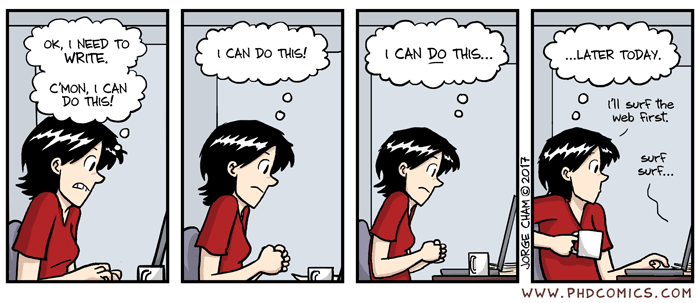
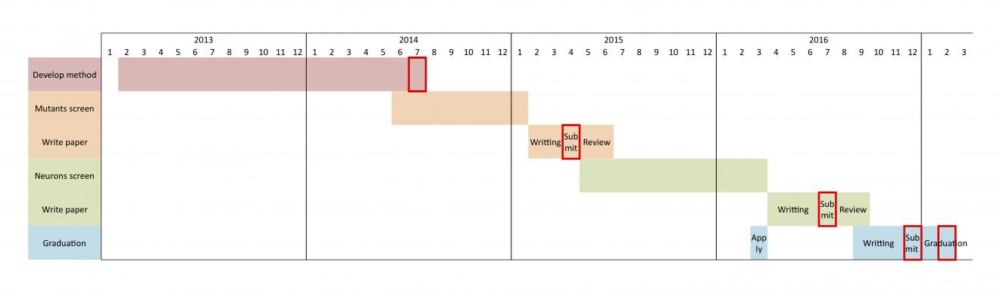
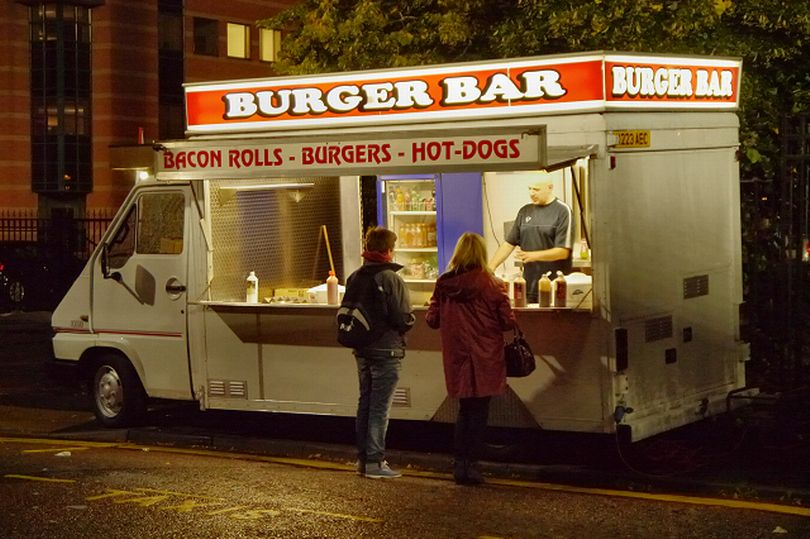

```{r setup, include=FALSE}
options(htmltools.dir.version = FALSE)
```

```{r xaringan-all, echo=FALSE}
library(countdown)
library(xaringan)
library(xaringanExtra)
library(knitr)
xaringanExtra::use_broadcast()
xaringanExtra::use_scribble()
#xaringanExtra::use_slide_tone()
xaringanExtra::use_search(show_icon = TRUE)
xaringanExtra::use_freezeframe()
xaringanExtra::use_clipboard()
xaringanExtra::use_fit_screen()
xaringanExtra::use_extra_styles(
  hover_code_line = TRUE,         
  mute_unhighlighted_code = TRUE  
)
```

class: inverse, center, title-slide, middle

<style>
.title-slide .remark-slide-number {
  display: none;
}
</style>

```{r load_packages, message=FALSE, warning=FALSE, include=FALSE}
library(fontawesome)
```

# Studying for a dissertation

### Andy MacLachlan

### 14/04/2021 (updated: `r format(Sys.time(), "%d/%m/%Y")`)

`r fa("paper-plane", fill = "white")`[a.maclachlan@ucl.ac.uk](mailto:a.maclachlan@ucl.ac.uk)
`r fa("twitter", fill = "white")`[andymaclachlan](https://twitter.com/andymaclachlan)
`r fa("github", fill = "white")`[andrewmaclachlan](https://github.com/andrewmaclachlan)
`r fa("map-marker", fill = "white")`[Centre for Advanced Spatial Analysis, UCL](https://www.ucl.ac.uk/bartlett/casa/)

<a href="https://github.com/andrewmaclachlan" class="github-corner" aria-label="View source on GitHub"><svg width="80" height="80" viewBox="0 0 250 250" style="fill:#fff; color:#151513; position: absolute; top: 0; border: 0; left: 0; transform: scale(-1, 1);" aria-hidden="true"><path d="M0,0 L115,115 L130,115 L142,142 L250,250 L250,0 Z"></path><path d="M128.3,109.0 C113.8,99.7 119.0,89.6 119.0,89.6 C122.0,82.7 120.5,78.6 120.5,78.6 C119.2,72.0 123.4,76.3 123.4,76.3 C127.3,80.9 125.5,87.3 125.5,87.3 C122.9,97.6 130.6,101.9 134.4,103.2" fill="currentColor" style="transform-origin: 130px 106px;" class="octo-arm"></path><path d="M115.0,115.0 C114.9,115.1 118.7,116.5 119.8,115.4 L133.7,101.6 C136.9,99.2 139.9,98.4 142.2,98.6 C133.8,88.0 127.5,74.4 143.8,58.0 C148.5,53.4 154.0,51.2 159.7,51.0 C160.3,49.4 163.2,43.6 171.4,40.1 C171.4,40.1 176.1,42.5 178.8,56.2 C183.1,58.6 187.2,61.8 190.9,65.4 C194.5,69.0 197.7,73.2 200.1,77.6 C213.8,80.2 216.3,84.9 216.3,84.9 C212.7,93.1 206.9,96.0 205.4,96.6 C205.1,102.4 203.0,107.8 198.3,112.5 C181.9,128.9 168.3,122.5 157.7,114.1 C157.9,116.9 156.7,120.9 152.7,124.9 L141.0,136.5 C139.8,137.7 141.6,141.9 141.8,141.8 Z" fill="currentColor" class="octo-body"></path></svg></a><style>.github-corner:hover .octo-arm{animation:octocat-wave 560ms ease-in-out}@keyframes octocat-wave{0%,100%{transform:rotate(0)}20%,60%{transform:rotate(-25deg)}40%,80%{transform:rotate(10deg)}}@media (max-width:500px){.github-corner:hover .octo-arm{animation:none}.github-corner .octo-arm{animation:octocat-wave 560ms ease-in-out}}</style>

---
class: inverse, center, middle



---
class: inverse, center, middle

# Start somewhere...anywhere, but make sure you start

---

# What do(n't) you know?

It's easy to list everything you don't know or aren't good at

**Focus on and list:**

- What methods you know

- What literature you know / have read

- What theories you know

- What tools you know

--

**Once you have that the link them together:**

- Mind map

- Miro board

- Trello board

- Literature review or summary

- Who agrees and disagrees, where, why, when, what has changed

---
class: inverse, center, middle


---
# Set expectations 

What do you want to gain from the dissertation and what is your end **GOAL** to the degree?

Tell you supervisor: 

* What you want to do after your degree

* What skills you think you might need

* Ask them what they think

--

**THEN** 

* Set up your dissertation to ensure you cover them

* Demonstrate them to your supervisor and the wider world?

* Ask them what they think, from their experience 

---

class: inverse, center, middle

# Remember it's *your* project
---
# Read `r fa("book-reader")`

Most staff members will say *"you should read widely"* but what does this mean and why bother?

Partly, it goes back to what do you want to learn? But also there are two "types" of reading:

--

1. Setting the scene reading

  * This refers to broader, often global challenges, perahps from a different discipline altogether   

  * Journals such as Science, Nature or Global policy documents

--

2. Technical reading

  * The nitty gritty of the methods

  * The specific detail of your study area

  * Perhaps local policy challenges
  
  * Usually more specialist journals 
---
class: inverse, center, middle

```{r echo=FALSE, out.width = "400pt", fig.align='center'}
 
```
---
# Writing - introduction

If you look at any paper, they usually start with a broad introduction to the issue they are exploring.

The introduction will talk about Global challenges:

* Global urban area expansion

* Population increase

* Challenges of sustainability 

Towards the end of the introduction links will be made to specific local case studies / literature

* For example, in the London Plan temperature mitigation is specified but no methodological details are provided

* In recent years the development of local models to predict temperature has resulted in the potential to actively reform building construction yet....

---
class: inverse, center, middle
# Start of introduction
>Traffic safety problems are causing incommensurate harm to pedestrians in cities around the world (Bartolomeos et al. 2013). In the United States, 49,340 pedestrians were killed by moving vehicles between 2008 and 2017 (Zaccaro 2019). As walkability becomes more central in the minds of transportation planners, government officials, and citizens due to the corresponding advantages in the realms of health, wealth, and happiness (see section 2.1), it is critical that pedestrian traffic fatalities come to be seen not as inevitable accidents, but as ‘preventable and unacceptable’ occurrences (City of Charlotte DOT 2019, p. 8). Further, it is essential that burgeoning cities like Charlotte, North Carolina, where this study is focused, are able to grow in ways that are both sustainable and appealing. In such places, effectively addressing pedestrian safety and walkability will be one of the keys to future success. Accordingly, this goal is an important component of various global and local policies (see section 2.2).

`r countdown(minutes=1, seconds =30, warn_when = 10, top=0, left=0)`
---
class: inverse, center, middle
# End of introduction
> Ultimately, this study intendsto contribute to the field of traffic safety research by further investigating the possibilities for data-driven advocacy for pedestrian needs and solutions. In the words of the visionary Enrique Penalosa, ‘The essence of the conflict today, really, is cars and people...We can have a city that is very friendly to cars, or a city that is very friendly to people. We cannot have both’ (NYC Streets Renaissance 2006).

`r countdown(minutes=00, seconds =45, warn_when = 10, top=0, left=0)`

---
# Writing - literature review

What has been done before, write a story and show what you are trying to investigate and contribute.

What not to do - that students always do despite how many times i tell them.

> Jones et al. (2017) found an interesting relationship between tree canopy coverage and heart diseases. They concluded more trees should be planted where there is a higher prevalence of heart disease. Zhang et al. (2014) found no relationship between tree canopy coverage. Smith et al. (2007) showed that trees and lung disease were related. 

This is just a list. Your job is to tell a story:

* What do studies show broadly are they similar or different
* How do studies advance each other
* What do they agree on 
* What do they disagree on
* Why do you think that is
* How can that be applied to your study.

---
class: inverse, center, middle
# Literature review example

> According to the World Health Organization, twenty-two percent of all road fatalities each year are pedestrians (Bartolomeos et al. 2013, p. vii). This unsettling statistic can perhaps be attributed to the rapid growth of urban centers, paired with a lack of effort to expand pedestrian facilities (Halais 2020). Indeed, pedestrian safety is a problem all over the world. In cities in sub-Saharan Africa, more than half of all trips occur by foot (Pendakur 2005, p. 10), yet pedestrians are regularly and disproportionately involved in incidents with motor vehicles due to a lack of sufficient walkways, lighting, and other helpful urban design provisions (Halais 2020, Murgu´ıa 2018). 

`r countdown(minutes=1, seconds =00, warn_when = 10, top=0, left=0)`

---
# Writing - methods, results

In the methods the writing usually stays focused on the current study area. It's good to have a few links to Global issues. For example:

--

* Whilst the study has used this local data, a Global alternative is x

--

* This attempts to provide a methodological basis for use with the Global Sustainable Development Goal, x, y, z

--

* The results show x, y, z, this contrasts to Jones et al. 2017 who exhibited this other trend

Don't just list your results you want a sprinkling of literature throughout. 
---
class: inverse, center, middle
# Methods example

## Provide a high level overview first

> The number of crashes were predicted per road segment using the selected negative binomial regression model and the predictions were compared to the true values, again using MAE, MSE, and RMSE. Where an observation was missing data, the required values were imputed using the rfImpute() function (Breiman 2003). The predicted crashes were mapped, with emphasis on the top 1% and top 25% most dangerous roads. Kumfer et al. (2019) used Empirical Bayes estimates to weight the predictions with historical crash data, but this step was omitted here. The authors write that the non-weighted predictions offer ‘a more holistic measure of pedestrian crash risk, given the uncertainty about future crash locations inherent in any crash prediction method’ (Kumfer et al. 2019, p. 427).

`r countdown(minutes=1, seconds =00, warn_when = 10, top=0, left=0)`

---
class: inverse, center, middle
# Results example

> Figures 4.3 and 4.4 display the actual crash data and the predicted number of crashes spatially. These visualizations show that the model predictions have captured roads that have been dangerous in the past, while also highlighting roads that should potentially be the focus of future concern. To further emphasize the unsafe areas highlighted by the model, the top 1% and top 25% most dangerous roads based on the number of predicted crashes were located and mapped (see figure 4.5). The actual and predicted crash statistics for the 6 roads in the top 1% most dangerous can be seen in table 4.4.

`r countdown(minutes=0, seconds =45, warn_when = 10, top=0, left=0)`

---

class: inverse, center, middle
# Discussion 


---
# Discussion

The point of a discussion to critically reflect on your results in relation to literature and policy that you navigated through in the introduction / literature review.

Critical reflection is not the limitations of the project
.pull-left[
- How do your methods / results differ to that of literature and policy
  - do they differ? 
  - why do you think that is?

- What is the point of your study / what can you suggest or recommend?
  - the point **IS NOT** to merely "support policy"
  - be really specific 
]
.pull-right[
```{r echo=FALSE, out.width = "200pt", fig.align='center'}
 
```
]

The discussion flips the funnel we saw earlier, you go from being specific about your project to broader contributions

---
class: inverse, center, middle
# Discussion example 1

> As part of Charlotte’s work with Vision Zero, an online interactive feedback map was developed to allow citizens the opportunity to share concerns about traffic safety within the city (see figure 5.1). Griffin & Jiao find that the use of such digital technologies may introduce accessibility challenges and bias, but that ultimately, ‘Crowdsourcing tools can be valuable approaches to increase geography and equity of public participation in transportation planning’ (Griffin & Jiao 2019, p. 460). The Charlotte Vision Zero report explains: ‘The top five comments submitted related to traffic safety concerns were street design, speeding, lack of pedestrian facilities, failing to yield to pedestrians and drivers running stop signs and red lights’ (City of Charlotte DOT 2019, p. 22). The analysis conducted here has the potential to quantify the impact of changes to the built environment in terms of the number of pedestrian collisions, which could be a powerful tool for advocating for pedestrian needs in the city when combined with existing efforts such as the interactive map

`r countdown(minutes=1, seconds =0, warn_when = 10, top=0, left=0)`

---
class: inverse, center, middle
# Discussion example 2

> The module “Document Management” provides ways to identify the change of information effectively. In the case study, the structural team members can find out what modification has been added in the model file by the architectural team, they can compare the versions of the model and all the additional features will be highlighted as Figure 11

`r countdown(minutes=0, seconds =30, warn_when = 10, top=0, left=0)`

---
# Conclusion

The conclusion simply provides a brief overview of the project:

--


* restate what you set out to achieve 

--

* briefly say how you did it

--


* what the main results were

--

* how this can contribute to future policy and/or literature

--

**No new material or references are in the conclusion** 
---
class: inverse, center, middle
# Conclusion example (start of conclusion)

> Improving walkability is gaining traction as an essential strategy for achieving economic, public health and sustainability goals in cities worldwide. The newfound appreciation for walkability has coincided with concern about effectively facilitating safe walking journeys. While data-driven analysis methods have long been used to study vehicular traffic, such methods are only recently being applied to pedestrian problems

`r countdown(minutes=0, seconds =45, warn_when = 10, top=0, left=0)`
---
# Conclusion

The conclusion simply provides a brief overview of the project:

--

* restate what you set out to achieve 

--

* briefly say how you did it

--

* what the main results were

--

* how this can contribute to future policy and/or literature

**No new material or references are in the conclusion** 
---
# Top tips

Thinks that the majority of good MSc dissertations have, that no one really tells you. Remember that you will be editing this document daily, your marker won't! Guide them through it.

--

`r fa("check-square", fill = "black")` At the end of the introduction you might consider having a very short section explaining the structure of the thesis. Chapter 1 provides a review of recent methods into x y z, Chapter 2. A flow diagram is also useful to show how ideas / data progresses.

--

`r fa("check-square", fill = "black")` Introduce every new chapter with a short paragraph. Summarise what the previous chapter said and state what this one will contribute or further. 

--

`r fa("check-square", fill = "black")` Try to avoid having a results/discussion. Often (not always) this means there will be no discussion. 

--

`r fa("check-square", fill = "black")` Look at the good dissertations, how many figures do they have? Are they all referenced in the text? Are they nicely laid out? Are variables named with _ or IN CAPS or A MiXtURE

--

`r fa("check-square", fill = "black")` Make your work relevant - Cheyne's dissertation section 2.2.1 - Global and local policies.

---
# Top tips 2

`r fa("check-square", fill = "black")`Send your supervisor work before meetings.

--

`r fa("check-square", fill = "black")`Ask questions the right way.

```{r, echo=FALSE, message=FALSE, warning=FALSE}
library(dplyr)
library(knitr)
library(kableExtra)
library(data.table)
DT = data.table(
  Student = c("Hussein Mahfouz","Cheyne Campbell","Jamie Ser Nee Tan","Greg Slater","Thomas Keel","Joshua Yee"),
  Award = c("GIScience (joint)","Planning and Environment","Population Geography","Planning and Environment", "GIScience (joint)", "Population Geography"),
  Year = c(2020,2020,2020,2019,2019,2019),
  url = c("https://github.com/Hussein-Mahfouz/Bicycle-Network-Optimization","https://github.com/cheynecampbell/charlotte-pedestrian-safety", "https://github.com/jamietansernee/sg-heritage-gentrification", "script in thesis", "https://github.com/Thomasjkeel/MSc_Dissertation", "https://jytg17.github.io/Unpacking-the-Nuances-of-Londons-Neighbourhood-Change-Gentrification-Trajectories/"))

dt_url <- c("https://github.com/Hussein-Mahfouz/Bicycle-Network-Optimization","https://github.com/cheynecampbell/charlotte-pedestrian-safety", "https://github.com/jamietansernee/sg-heritage-gentrification", "", "https://github.com/Thomasjkeel/MSc_Dissertation", "https://jytg17.github.io/Unpacking-the-Nuances-of-Londons-Neighbourhood-Change-Gentrification-Trajectories/")

DT %>% 
  mutate(url = cell_spec(DT$url, "html", link = dt_url)) %>%
  kable("html", escape = FALSE) %>%
  kable_styling(bootstrap_options = c("hover", "condensed")) 
```

---
# It's iterative 

.pull-left[
The process **you think** you will do

- Introduction

- Literature review

- Methods

- Results

- Discussion 

- Conclusion
]
--
.pull-right[
The process **you will** do

- Literature review

- Methods

- Literature review

- Methods

- Results

- Discussion 

- Literature review

- Discussion 

- Introduction

- Conclusion

]
---
# Project planning

Gantt Charts, Trello boards, Research logs

.pull-left[
```{r image_grobs, echo=FALSE, fig.align="default", out.width="100%"}
 
```
]
.pull-right[
```{r image_grobs2, echo=FALSE, fig.align="default", fig.show="hold", out.width="100%"}
knitr::include_graphics('img/trello.png') 
```
]

```{r image_grobs3, echo=FALSE, fig.align="default", fig.show="hold", out.width="30%"}
knitr::include_graphics('img/research_log.png') 
```
---
class: inverse, center, middle
# Make some kind of plan 
--

### But be adaptable when it changes

---
# Original etc

**Original:** You need to write the assignment in your own words that tells a narrative through the existing research. Don’t just state what others have done 
present or existing from the beginning; first or earliest

--

**Coherent:** Make your points in a logical manner, with support from literature (or policy documents). Don’t just assume the reader knows what you are talking about because they are an academic. Build the story, don’t just jump to the ending.
logical and consistent

--

**Insightful:** Clearly showing that you understand the methods, concepts and debates discussed but also how your analysis (or discussion) did or could add meaning in some way. 
having or showing an accurate and deep understanding; perceptive.

---
# Recall research language

**Research gap:** You need to identify and discuss all the existing work and lead the reader to the gap. What is the gap. What hasn’t been done. Why is that important. MISSING

--

**Contribution:** You’ve identified the gap. Be specific throughout your thesis what you are contributing…..As a result this thesis attempts to combine these two datasets for THIS REASON. Continue this through the thesis, especially in the discussion. A POTENTIAL ANSWER

--

**Novel:** What is new? Remember this could be a new method, a new study area or a bit of both (or mix too). E.g. use an existing method with a slight variation appropriate for a new study area and some different data as that’s what was available or is free! WHAT IS NEW

---
class: inverse, center, middle
# Write yours down

Try writing yours down now

Do this regularly

`r countdown(minutes=0, seconds =45, warn_when = 10, top=0, left=0)`
---
class: inverse, center, middle
# Read the markscheme weekly

> Interpretations of results are very well constructed, clear and focused with a well developed narrative throughout. The discussion provides appropriate critical reflections on the project’s outcomes, strengths and limitations with good links to relevant academic and policy (if applicable) debates.
---

class: inverse, center, middle
# Set a realistic research question 

### The more specific you are with it the easier it will be to undertake your project

this paper aims to critically examine typologies of neighbourhood change in order to provide insight into different pathways of neighbourhood transition in Singapore, while constructing an effective visualisation of Singapore’s gentrification landscape to aid spatial targeting of policy-making.

--

to evaluate the effects of family planning policies on the population, and the response from population to family planning policies

---

class: inverse, center, middle
# Objectives?  

### Often confused with research questions. Usually you have 1 or max 2, research questions

What features of the built environment are thought to influence pedestrian safety, and can our understanding of these relationships be strengthened?

What are the challenges when it comes to studying pedestrian safety in terms of the lack of available pedestrian data? Does Charlotte collect and make public the data required for this type of analysis?

--

To simulate the population changes in three different policy

To understand the policy changes according to the simulation results

---
# Recall aims, questions and objectives

**Research question:** Is the central question to the thesis that you will try to answer

--

How might longitudinal census data and resale prices of residential properties lend insight into spatial patterns of potential neighbourhood gentrification prompted by conserved built heritage in Singapore?

---
# Recall aims, questions and objectives

**Research aim:** Is a broad statement of intent that you will try and achieve within your thesis, it is usually just the research question rephrased

--

this paper aims to critically examine typologies of neighbourhood change in order to provide insight into different pathways of neighbourhood transition in Singapore, while constructing an effective visualisation of Singapore’s gentrification landscape to aid spatial targeting of policy-making

---
# Recall aims, questions and objectives

**Research objectives:** Think of research objectives as the set of measurable and specific goals you need to achieve your aim / research question. As you tick each one off you build a stronger case for answering the research question. It’s good practice (but not always essential) for objectives to follow the S.M.A.R.T. format

--

* What features of the built environment are thought to influence pedestrian safety, and can our understanding of these relationships be strengthened?

--

* What are the challenges when it comes to studying pedestrian safety in terms of the lack of available pedestrian data? Does Charlotte collect and make public the data required for this type of analysis?

--

* Most importantly, how can the findings of this research be used to improve upon existing policy or urban design strategies by highlighting targeted areas and adjustments for improved pedestrian safety?
---

class: inverse, center, middle
# Research question, aim, objectives?  
--

### Different examples have different combinations 
--

You need a research question and or aim

--

**AND** objectives
---

class: inverse, center, middle
# Where do I state them?  
--

### Usually at the end of the introduction 

---
# How else to study

## It's a 9-5 job

* **Study in chunks** - research a particular topic for a set amount of time - a day, two days, a week? Depending on how important that topic is to your dissertation 

--

* **Plan** - what do you want to achieve today

--

* **Reflect** - did you do it? why not? was it too ambitious? was the task bigger than you thought

--

* **adjust** - use the new knowledge you've gained, can you now adjust your research question or topic even?

--

* **is it useful** - do you need this? What is it contributing? 

--

* **don't read everything** - there is so much out there, at some point you need to stop, when is that? 
---

class: inverse, center, middle
# Reward yourself  
--

### After doing x i will do y 
---
# How else to study 2

## Collaborate / talk to each other

* With your supervisor 

--

* With each other

--

* If you have questions come to discuss them + solutions rather than expect answers.

--

> I'm struggling to classify urban areas from satellite imagery, what do i do

--

> I'm struggling to classify urban areas from satellite imagery. I've tried using Maximum likelihood but it doesn't produce very good results. I've read about SVM, do you think i should try it 

--

* Describe your work in detail, including in captions. "Figure 6: Plot of GWR"
---

class: inverse, center, middle
# What are you selling

```{r echo=FALSE, out.width = "400pt", fig.align='center'}
 
```

---
# Next week

* How to set up your dissertation document

  * Word (briefly)

  * Bookdown (using RMarkdown) - https://andrewmaclachlan.github.io/CASA-MSc-thesis/

* Any requests on Slack

* Q and A
